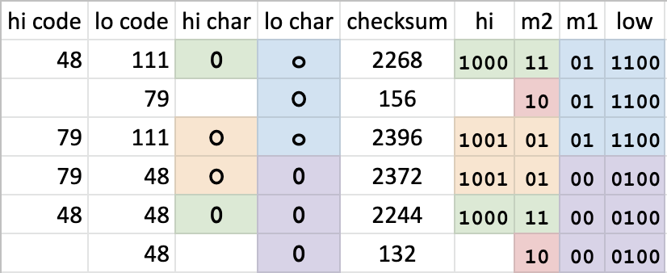

# tsql-checksum-javascript
T-SQL's `CHECKSUM()` algorithm reverse engineered and implemented in JavaScript

What _is_ the algorithm? It's a simple circular (rotate) shift left by a nibble
(4 bits) and a XOR of each character translated into a "code". The code is _not_
ASCII but it is related because lowercase letters bear the same codes as their
uppercase counterparts and digits have codes just before "A". To see the codes
and the algorithm itself, take a peek at `tsql-checksum.js`!

## Limitations / Disclaimer

My work has focused only on ASCII strings using the (`VARCHAR`) data type and on
SQL Server instances with the default collation setting:
`SQL_Latin1_General_CP1_CI_AS`. I have no doubt the same algorithm is used but
with different binary input and XOR codes for other collation and data types.

## Background

I got started on this quest after posting what I thought was an innocuous
question on StackOverflow:

[How to Implement T-SQL CHECKSUM() in JavaScript for BigQuery?](https://stackoverflow.com/questions/58980138/)

A semi-helpful comment appeared soon after with
[a link](https://stackoverflow.com/questions/16316009/) that led me down a
rabbit-hole and not too much after a downvote and a comment telling me quite
frankly *NOT* to use this dated and terrible hash function. I then spent the
remaining work day attempting to figure out the shoddy algorithm which
none-the-less is a practically immortal part of Microsoft SQL Server. Knowing
precisely how it works, I reasoned, would be helpful to anyone whether they're
maintaining code that uses it or simply needing convincing why not to use it.

Near the end of the day I found that the SQL code posted for the algorithm
([from 2006 on sqlteam.com](https://www.sqlteam.com/forums/topic.asp?TOPIC_ID=70832))
is actually for `BINARY_CHECKSUM()` rather than `CHECKSUM()`. Doh! This repo
will *not* be for that function for which code has already been created that
seems to work in my brief tests of it.

Thus I created _this_ project to take over where those left off and to solve the
mystery that no one was bothered by. I knew it wouldn't be too complicated when
I noticed very specific patterns between one and two character ASCII
combinations:

The `data/pairs.csv` contains the `CHECKSUM()` output for all ASCII pairs but be
careful with those code points above 128; that stuff is currently untested in
my implementation.

## SQL Server in VirtualBox

I'm running SQL Server (Express) in VirtualBox on a Windows 10 VM. This is a
[free thing provided by Microsoft](https://developer.microsoft.com/en-us/windows/downloads/virtual-machines)
but it's not without hazards. I routinely mess up the configuration so that I
am unable to connect to it. So here's my reference checklist:

  1. NAT port forwarding for 1433 on VirtualBox: use 127.0.0.1 on host and blank on guest so that port is only open to the host itself.
  2. TCP/IP protocol enabled in SQL Server Configuration Manager.
  3. Windows Firewall rule to allow SQL Server (or turned off) on _both_ public and private networks,.
  4. SQL Server Browser service is enabled and automatically started. 

I set this up myself and later found a [nice tutorial on StackOverflow](https://stackoverflow.com/a/37616522/9642).

Free Windows VMs provided by Microsoft: 

## Links

  * [Inconsistent CHECKSUM results](https://social.msdn.microsoft.com/Forums/sqlserver/en-US/a0818cd0-cd84-43ad-9266-2c50c38affdf/inconsistent-checksum-results?forum=transactsql)
    (social.msdn.microsoft.com): Long strings return 0.
  * [Hash Code and Checksum - what's the difference?](https://stackoverflow.com/questions/460576/hash-code-and-checksum-whats-the-difference)
    (stackoverflow.com)
  * [CHECKSUM replacement for IMAGE and TEXT](https://www.sqlteam.com/forums/topic.asp?TOPIC_ID=70832)
    (sqlteam.com): This has SQL code for performing a `BINARY_CHECKSUM()` but
    not `CHECKSUM()`.
  * [CHECKSUM and CHECKSUM_AGG: What's the algorithm?](https://stackoverflow.com/questions/16316009/checksum-and-checksum-agg-whats-the-algorithm)
    (stackoverflow.com): This is where I started my journey but there are no
    valid answers to the question and the specific function `CHECKSUM()`!
  * [CHECKSUM weakness explained](https://weblogs.sqlteam.com/peterl/2010/08/19/checksum-weakness-explained/)
    (weblogs.sqlteam.com)
  * [BINARY_CHECKSUM problems](https://www.sqlteam.com/forums/topic.asp?TOPIC_ID=70328)
    (sqlteam.com)
  * [Which algorithm is used for Binary_checksum() & checksum() function in SQL Server?](https://stackoverflow.com/questions/49345105/which-algorithm-is-used-for-binary-checksum-checksum-function-in-sql-serve)
    (stackoverflow.com)
  * [Exploring Hash Functions in SQL Server](http://blog.kejser.org/exploring-hash-functions-in-sql-server/)
    (blog.kejser.org)
